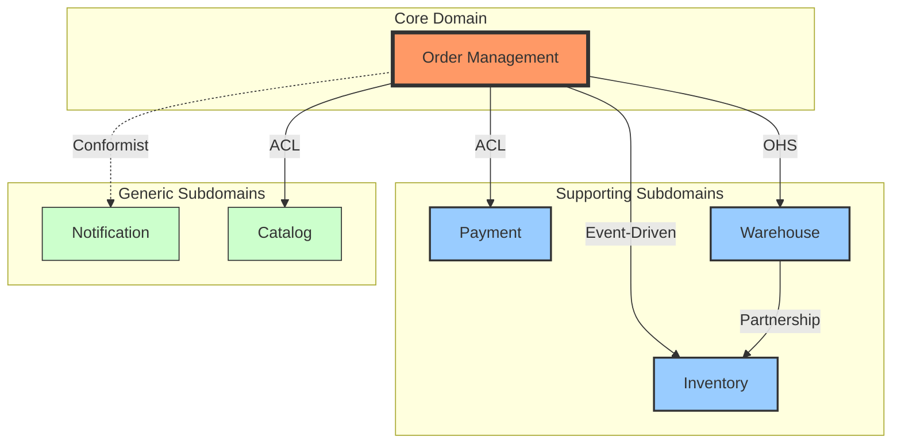

# DDD Strategic Design Output Templates

This document provides standard formats and examples for three core DDD
strategic design artifacts.

---

## 1. Bounded Context Analysis

### Purpose

Document each Bounded Context's responsibilities, boundaries, and relationships
with other Contexts.

### Format

```markdown
# Bounded Context: [Context Name]

## Overview
[1-2 paragraphs describing this Context's core responsibilities and reason for existence]

## Business Capabilities
- [Core business capability 1 provided by this Context]
- [Core business capability 2 provided by this Context]
- [Core business capability 3 provided by this Context]

## Domain Classification
- **Type**: Core Domain / Supporting Subdomain / Generic Subdomain
- **Strategic Importance**: High / Medium / Low
- **Complexity**: High / Medium / Low

## Ubiquitous Language (Core Terms)
| Term     | Definition                               | Notes                                              |
| -------- | ---------------------------------------- | -------------------------------------------------- |
| [Term 1] | [Precise definition within this Context] | [Differences from other Contexts or special notes] |
| [Term 2] | [Precise definition within this Context] | [Differences from other Contexts or special notes] |

## Core Entities and Aggregates
- **[Aggregate Name 1]**: [Brief description of aggregate root and main entities]
- **[Aggregate Name 2]**: [Brief description of aggregate root and main entities]

## Key Domain Events
- [Domain Event 1]: [When it occurs and its significance]
- [Domain Event 2]: [When it occurs and its significance]

## Boundaries and Responsibilities
### Included Responsibilities
- [Responsibility clearly belonging to this Context 1]
- [Responsibility clearly belonging to this Context 2]

### Excluded Responsibilities (Not Responsible For)
- [Responsibility clearly not belonging to this Context 1]
- [Responsibility clearly not belonging to this Context 2]

## External Integration Points
| Integration Target | Integration Method | Data Flow Direction            | Description                          |
| ------------------ | ------------------ | ------------------------------ | ------------------------------------ |
| [Other Context]    | [ACL/OHS/etc]      | [Bidirectional/Unidirectional] | [Purpose and content of integration] |

## Team and Ownership
- **Responsible Team**: [Team name]
- **Primary Contact**: [Name/Role]
- **Decision Authority**: [Who is responsible for design decisions in this Context]

## Technical Considerations
- **Primary Tech Stack**: [Programming language, framework]
- **Data Storage**: [Database type]
- **Deployment Model**: [Independent service / Module / Library]

## Evolution History and Future Plans
- **Current State**: [Current situation description]
- **Known Issues**: [Technical debt or design issues]
- **Future Plans**: [Expected changes or improvement directions]
```

### Example

```markdown
# Bounded Context: Order Management

## Overview
The Order Management Context handles the complete lifecycle of customer orders, from order creation, validation, through fulfillment coordination. This is the e-commerce platform's core Context, directly impacting revenue and customer experience.

## Business Capabilities
- Receive and validate customer orders
- Calculate order totals (including tax, discounts, shipping)
- Coordinate inventory reservation and payment processing
- Track order status and progress
- Handle order modifications and cancellations

## Domain Classification
- **Type**: Core Domain
- **Strategic Importance**: High
- **Complexity**: High

## Ubiquitous Language (Core Terms)
| Term         | Definition                                                                                                     | Notes                                                              |
| ------------ | -------------------------------------------------------------------------------------------------------------- | ------------------------------------------------------------------ |
| Order        | A formal record of a customer's purchase intent, including items, quantities, prices, and delivery information | Different from Cart — an Order represents a committed transaction  |
| Order Line   | A single item entry in an order, containing SKU, quantity, and unit price                                      | Can be independently cancelled or returned                         |
| Order Status | The current stage of the order in its lifecycle                                                                | Possible values: Pending, Confirmed, Shipped, Delivered, Cancelled |
| Fulfillment  | The physical process of completing an order, including picking, packing, and shipping                          | Actual execution is handled by the Warehouse Context               |

## Core Entities and Aggregates
- **Order Aggregate**: Order (aggregate root), OrderLine, ShippingAddress, BillingAddress
- **Pricing Aggregate**: Price, Discount, TaxRate

## Key Domain Events
- OrderPlaced: Published when an order is created; triggers inventory reservation and payment processes
- OrderConfirmed: Published after successful payment; triggers the fulfillment process
- OrderCancelled: Published when an order is cancelled; releases reserved resources

## Boundaries and Responsibilities
### Included Responsibilities
- Order data integrity and consistency
- Order status lifecycle management
- Order-related business rule validation
- Order event publishing

### Excluded Responsibilities (Not Responsible For)
- Actual inventory deduction (handled by Inventory Context)
- Payment transaction processing (handled by Payment Context)
- Logistics and shipping execution (handled by Warehouse Context)
- Product information maintenance (handled by Catalog Context)

## External Integration Points
| Integration Target | Integration Method | Data Flow Direction              | Description                                                   |
| ------------------ | ------------------ | -------------------------------- | ------------------------------------------------------------- |
| Inventory Context  | Event-Driven       | Bidirectional                    | Request inventory reservation, receive inventory confirmation |
| Payment Context    | ACL                | Unidirectional (Order→Payment)   | Initiate payment requests                                     |
| Warehouse Context  | OHS                | Unidirectional (Order→Warehouse) | Issue fulfillment instructions                                |
| Catalog Context    | ACL                | Unidirectional (Order→Catalog)   | Query product information and prices                          |

## Team and Ownership
- **Responsible Team**: Transaction Core Team
- **Primary Contact**: Alice Chen (Tech Lead)
- **Decision Authority**: Order domain model decisions are made by the Transaction Core Team, coordinating business requirements with the product team

## Technical Considerations
- **Primary Tech Stack**: Java 17, Spring Boot, PostgreSQL
- **Data Storage**: PostgreSQL (transactional data), Redis (cache)
- **Deployment Model**: Independent microservice, containerized deployment

## Evolution History and Future Plans
- **Current State**: In production for 2 years, stably handling ~100K orders per day
- **Known Issues**: Order modification logic is overly complex; refactoring needed
- **Future Plans**: Considering Event Sourcing to better track order change history
```

---

## 2. Context Map

### Purpose

Visually represent the relationships and integration patterns between Bounded
Contexts.

### Context Mapping Patterns

#### Team Collaboration Patterns

- **Partnership**: Two teams collaborate closely and co-evolve
- **Shared Kernel**: Two Contexts share part of the domain model
- **Customer-Supplier**: The downstream team depends on interfaces provided by the upstream team

#### Independent Evolution Patterns

- **Conformist**: Downstream fully accepts the upstream model with no negotiating power
- **Anticorruption Layer (ACL)**: Downstream builds a translation layer to isolate upstream influence
- **Open Host Service (OHS)**: Upstream provides a standardized public API
- **Published Language**: Uses industry-standard formats (e.g., JSON Schema)

#### Special Patterns

- **Separate Ways**: Two Contexts are completely independent with no integration
- **Big Ball of Mud**: A chaotic legacy system with no clear boundaries

### Text Format

```markdown
# Context Map: [System Name]

## Contexts Overview

### [Context A]
- **Type**: Core Domain
- **Team**: [Team name]

### [Context B]
- **Type**: Supporting Subdomain
- **Team**: [Team name]

## Context Relationships

### [Context A] → [Context B]: [Relationship Pattern]
- **Direction**: A depends on B / B depends on A / Bidirectional dependency
- **Integration Method**: REST API / Event Bus / Shared Database / RPC
- **Data Flow**: [What data flows between them]
- **Rationale**: [Why this relationship pattern was chosen]

### [Context B] ← [Context C]: [Relationship Pattern]
- **Direction**: ...
- **Integration Method**: ...
- **Data Flow**: ...
- **Rationale**: ...
```

### Diagram Format (Mermaid)



### Example

```markdown
# Context Map: E-Commerce Platform

## Contexts Overview

### Order Management
- **Type**: Core Domain
- **Team**: Transaction Core Team
- **Responsibility**: Order lifecycle management

### Inventory
- **Type**: Supporting Subdomain
- **Team**: Supply Chain Team
- **Responsibility**: Inventory tracking and reservation

### Payment
- **Type**: Supporting Subdomain
- **Team**: Payment Team
- **Responsibility**: Payment processing and reconciliation

### Warehouse
- **Type**: Supporting Subdomain
- **Team**: Operations Team
- **Responsibility**: Order fulfillment and logistics

### Catalog
- **Type**: Generic Subdomain
- **Team**: Content Team
- **Responsibility**: Product information management

### Notification
- **Type**: Generic Subdomain
- **Team**: Platform Team
- **Responsibility**: Email, SMS, and push notifications

## Context Relationships

### Order Management → Inventory: Event-Driven
- **Direction**: Bidirectional dependency
- **Integration Method**: Message Queue (RabbitMQ)
- **Data Flow**:
  - Order→Inventory: InventoryReservationRequested event
  - Inventory→Order: InventoryReserved / InventoryUnavailable event
- **Rationale**: Event-driven approach ensures asynchronous inventory reservation processing, avoiding blocking the order creation flow

### Order Management → Payment: Anticorruption Layer (ACL)
- **Direction**: Order depends on Payment
- **Integration Method**: REST API with ACL
- **Data Flow**: Payment requests and result queries
- **Rationale**: The Payment Context model is complex and changes frequently; the ACL isolates these changes so the Order Context uses a simplified internal payment model

### Order Management → Warehouse: Open Host Service (OHS)
- **Direction**: Order depends on Warehouse
- **Integration Method**: Warehouse provides a standardized REST API
- **Data Flow**: Fulfillment instructions (Fulfillment Order)
- **Rationale**: Warehouse serves as a provider for multiple upstream Contexts, offering a stable public interface

### Order Management → Catalog: Anticorruption Layer (ACL)
- **Direction**: Order depends on Catalog
- **Integration Method**: GraphQL API with ACL
- **Data Flow**: Product information queries (prices, inventory status)
- **Rationale**: Catalog's data model is content-management oriented, different from Order's transactional model; the ACL handles the translation

### Warehouse ↔ Inventory: Partnership
- **Direction**: Bidirectional close collaboration
- **Integration Method**: Direct API calls + Shared Events
- **Data Flow**: Physical inventory changes, picking confirmations
- **Rationale**: Both teams share responsibility for physical inventory accuracy and need to collaborate closely and co-evolve

### Order Management → Notification: Conformist
- **Direction**: Order depends on Notification
- **Integration Method**: Event Bus (unidirectional)
- **Data Flow**: Order status notification requests
- **Rationale**: Notification is a generic service; Order accepts its defined event format without needing a translation layer

## Strategic Decisions

1. **Why use event-driven for Order ↔ Inventory?**
   - Inventory reservation may take time and is not suited for synchronous APIs
   - Decouples the two Contexts, allowing independent scaling

2. **Why are multiple ACLs needed?**
   - Payment and Catalog models differ significantly; direct use would pollute the Order domain model
   - ACLs provide stable internal interfaces, isolating external changes

3. **Why OHS for Warehouse?**
   - Multiple upstream Contexts need warehouse services (Order, Return, Transfer)
   - A standardized interface reduces maintenance costs
```

---

## 3. Ubiquitous Language Glossary

### Purpose

Record precise terminology definitions for the entire system or a specific
Bounded Context, ensuring unambiguous team communication.

### Format

```markdown
# Ubiquitous Language: [Context or System Name]

## How to Use This Glossary
- **Scope**: This glossary covers [specific scope]
- **Maintained by**: [Responsible person/team]
- **Update frequency**: Updated immediately whenever terms are added or modified

---

## [Category 1: e.g., "Core Entities"]

### [Term 1]
- **English**: [English Term]
- **Definition**: [Clear, unambiguous definition]
- **Example**: [Practical usage example]
- **Related Terms**: [Other related terms]
- **Notes**: [Common misconceptions or differences from other Contexts]

### [Term 2]
- **English**: [English Term]
- **Definition**: ...

## [Category 2: e.g., "States and Lifecycle"]

...

## [Category 3: e.g., "Business Rules and Constraints"]

...
```

### Example

```markdown
# Ubiquitous Language: Order Management Context

## How to Use This Glossary
- **Scope**: All domain terms used within the Order Management Bounded Context
- **Maintained by**: Transaction Core Team
- **Update frequency**: Updated immediately whenever terms are added or modified
- **Version**: v2.3 (2025-10-20)

---

## Core Entities

### Order
- **Definition**: A purchase commitment submitted by a customer to the system, containing one or more item entries, delivery information, and payment information. Once created, an order generates a fulfillment obligation.
- **Example**: "Order #ORD-20251020-00123 contains 3 order lines"
- **Related Terms**: Order Line, Order Status, Fulfillment
- **Notes**:
  - Different from Cart: A Cart is temporary and freely modifiable; an Order is a formal commitment
  - Different from Fulfillment Context's "Fulfillment Order": that is from the warehouse execution perspective; our Order is from the transaction perspective

### Order Line (Line Item)
- **Definition**: A single item entry in an order, containing SKU, quantity, unit price, and subtotal. An Order Line is a component of an order and cannot exist independently.
- **Example**: "Order line: SKU-12345 × 2, unit price $500, subtotal $1,000"
- **Related Terms**: Order, SKU, Quantity
- **Notes**:
  - Can be individually cancelled or returned, but still belongs to the parent order
  - Price is locked at Order Line creation time and is not affected by subsequent Catalog price changes

### Customer
- **Definition**: A natural person or legal entity that places orders in the system. In the Order Context, we only care about customer identification (Customer ID) and contact information; we do not handle complete customer data management.
- **Example**: "Customer #CUST-789 placed a new order"
- **Related Terms**: Order, Shipping Address, Billing Address
- **Notes**:
  - Detailed customer data (membership tier, preferences, etc.) is managed by the Customer Context
  - We only store a minimal copy of customer information needed for the order

---

## States and Lifecycle

### Order Status
- **Definition**: The current stage of an order in its lifecycle. State transitions follow specific business rules and cannot be arbitrarily skipped.
- **Possible values**:
  - `Pending`: Order created, awaiting payment confirmation
  - `Confirmed`: Payment successful, order confirmed
  - `Preparing`: Warehouse is preparing for shipment
  - `Shipped`: Has been shipped
  - `Delivered`: Has been delivered
  - `Cancelled`: Has been cancelled
  - `Refunded`: Has been refunded
- **Example**: "Order status transitioned from Confirmed to Preparing"
- **Related Terms**: Order, Order Lifecycle, Domain Events
- **Notes**:
  - State transitions publish Domain Events
  - Some state transitions are irreversible (e.g., Delivered → Pending)

### Fulfillment Status
- **Definition**: The physical fulfillment progress of an order, tracked independently from Order Status. This is information synchronized from the Warehouse Context.
- **Possible values**: `NotStarted`, `InProgress`, `Completed`, `Failed`
- **Example**: "The order's fulfillment status is InProgress"
- **Related Terms**: Order Status, Warehouse Context
- **Notes**:
  - Fulfillment Status is controlled by Warehouse; we only read it
  - Order Status and Fulfillment Status do not necessarily update in sync

---

## Business Rules and Constraints

### Order Modification Window
- **Definition**: The time limit after order confirmation during which a customer can modify order contents. After this window, modifications require a more complex process.
- **Rule**: Can be freely modified within 30 minutes of order confirmation; after that, customer service intervention is required
- **Example**: "This order has exceeded the modification window and cannot be automatically modified"
- **Related Terms**: Order Status, Order Confirmed
- **Notes**: The modification window does not apply to cancellation operations; cancellation has its own independent rules

### Minimum Order Amount (MOA)
- **Definition**: The minimum order total the system will accept. Orders below this amount cannot be submitted.
- **Rule**: Regular customers minimum $100; VIP customers have no minimum
- **Example**: "Order amount of $80 is below the minimum order amount and cannot be submitted"
- **Related Terms**: Order Total, Customer Type
- **Notes**: Does not include shipping fees and handling charges

### Inventory Reservation Timeout
- **Definition**: The duration for which the system reserves inventory after an order is created. If the order is still unpaid after this timeout, the reservation is released.
- **Rule**: Reservation time is 15 minutes
- **Example**: "Inventory reservation for Order #ORD-123 has timed out"
- **Related Terms**: Order Status, Inventory Context
- **Notes**: After timeout, the order status changes to Expired and the customer needs to place a new order

---

## Domain Events

### OrderPlaced
- **Definition**: An event published when a customer successfully submits an order. This is the starting point of the order lifecycle.
- **Trigger**: After the Order aggregate is created and persisted
- **Payload**: Order ID, Customer ID, Order Lines, Total Amount, Timestamp
- **Subscribers**: Inventory Context (inventory reservation), Payment Context (initiate payment), Notification Context (send confirmation)
- **Example**: `OrderPlaced { orderId: "ORD-123", customerId: "CUST-789", totalAmount: 1500 }`

### OrderConfirmed
- **Definition**: An event published when order payment succeeds and the order is officially confirmed.
- **Trigger**: After Payment Context notifies of successful payment and Order status is updated to Confirmed
- **Payload**: Order ID, Payment ID, Confirmed At
- **Subscribers**: Warehouse Context (begin fulfillment), Notification Context (notify customer)
- **Example**: `OrderConfirmed { orderId: "ORD-123", paymentId: "PAY-456", confirmedAt: "2025-10-20T10:30:00Z" }`

### OrderCancelled
- **Definition**: An event published when an order is cancelled, whether by the customer or the system.
- **Trigger**: After Order status is updated to Cancelled
- **Payload**: Order ID, Cancellation Reason, Cancelled By, Cancelled At
- **Subscribers**: Inventory Context (release reservation), Payment Context (refund processing), Notification Context (notify customer)
- **Example**: `OrderCancelled { orderId: "ORD-123", reason: "Customer Request", cancelledBy: "CUST-789" }`

---

## Value Objects

### Money
- **Definition**: A value object representing a monetary amount, including a numeric value and currency.
- **Properties**: `amount` (Decimal), `currency` (String, ISO 4217 code)
- **Example**: `Money { amount: 1500.00, currency: "USD" }`
- **Notes**:
  - Monetary calculations must consider precision; use Decimal, not Float
  - Amounts in different currencies cannot be directly added; currency conversion is required

### Address
- **Definition**: A value object representing a physical address, used for shipping and billing addresses.
- **Properties**:
  - `recipientName`: Recipient name
  - `phone`: Contact phone number
  - `postalCode`: Postal/ZIP code
  - `city`: City
  - `district`: District/Area
  - `street`: Street address
  - `details`: Additional details (floor, unit number, etc.)
- **Example**:
  ```

  Address {
    recipientName: "John Smith",
    phone: "555-123-4567",
    postalCode: "10001",
    city: "New York",
    district: "Manhattan",
    street: "122 Broadway",
    details: "3rd Floor"
  }

```text
- **Notes**:
  - Address is immutable; any modification produces a new Address instance
  - Validation logic includes postal code and city consistency checks

---

## Cross-Context Terminology Mapping

Some terms have different meanings in different Contexts and require special
attention:

| Order Context | Inventory Context   | Description                                                  |
| ------------- | ------------------- | ------------------------------------------------------------ |
| Order         | Reservation Request | An Order triggers an inventory reservation request           |
| Order Line    | Reserved Item       | Each Order Line corresponds to one inventory reservation     |
| Confirmed     | Committed           | Order confirmation corresponds to formal inventory deduction |

| Order Context | Warehouse Context | Description                                          |
| ------------- | ----------------- | ---------------------------------------------------- |
| Order         | Fulfillment Order | An order is converted into a fulfillment instruction |
| Shipped       | Out for Delivery  | Different status names but similar meaning           |

| Order Context   | Payment Context  | Description                                                      |
| --------------- | ---------------- | ---------------------------------------------------------------- |
| Order Total     | Payment Amount   | Same monetary concept, but Payment also includes processing fees |
| Order Confirmed | Payment Captured | Same timing, different perspectives                              |

---

## Version History

- **v2.3 (2025-10-20)**: Added Fulfillment Status; clarified difference from Order Status
- **v2.2 (2025-09-15)**: Updated Order Modification Window rule from 15 minutes to 30 minutes
- **v2.1 (2025-08-01)**: Added Cross-Context Terminology Mapping table
- **v2.0 (2025-06-01)**: Major revision; introduced Domain Events section
- **v1.0 (2025-01-01)**: Initial release
```

---

## Output Usage Guide

### When to Produce These Documents

1. **Bounded Context Analysis**:
   - When a new Context is identified
   - When a Context's responsibilities undergo significant changes
   - As onboarding material for new team members

2. **Context Map**:
   - During system architecture design phase
   - When planning cross-team collaboration
   - During refactoring or service decomposition
   - Periodic review (recommended quarterly updates)

3. **Ubiquitous Language**:
   - Create the initial version at project kickoff
   - Continuously update; record any terminology changes
   - Use to resolve team communication misunderstandings

### Document Maintenance Principles

- **Single Source of Truth**: Each Context's analysis document is maintained by that Context's responsible team
- **Version Control**: All documents should be under version control; significant changes need a changelog
- **Living Documentation**: These are not one-time artifacts — they must be continuously updated as the system evolves
- **Accessibility**: Ensure all relevant stakeholders can easily access these documents

### Output Format Recommendations

- **Markdown**: Suitable for version control; easy collaborative editing
- **Confluence/Notion**: Suitable when rich formatting and quick sharing are needed
- **Mermaid/PlantUML**: Graphical representation of Context Maps
- **ADR (Architecture Decision Records)**: Record important design decisions and trade-offs
